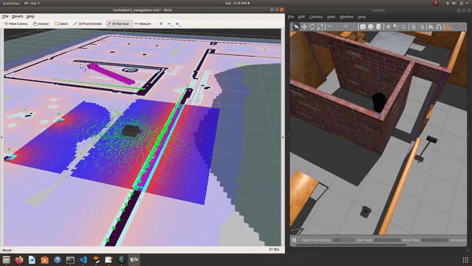

# ros_autonomous_slam

This consist of a ROS package which uses the Navigation Stack to autonomously explore an unknown environment with help of GMAPPING and constructs an Map of the explored environment. Finally a pathplanning algorithm from Navugation stack is used in the newly generated map to reach the goal.The Gazebo simulator is used for the simulation of the Turtlebot3 Waffle Pi robot. Various algorithms have been integrated for the Autonomously exploring the region and constructing the map with help of the 360 degree Lidar sensor. Different environments can be swapped within launch files to generate the map of the environment. 
> **As this repository is to be updated with more efficent algorithms, my next upcoming updates iam working on are**
> 1. The Randomly Exploring Random Tree algorithm (**RRT**) for autonomous exploration. 
> 2. **Self Repairing A* algorithm** which is known as Dynamic path planning in volatile enviroments.  
> **Keep following for the updates :)** 

### There are three Main steps to be executed in this project.
- Step 1 : Place the Robot in the Environment within Gazebo
- Step 2 : Perform Autonomous exploration of the environment and generate the Map
- Step 3 : Perform pathplanning and go to goal in the environment
### Follow the execution of the different Launch files to acheive the required tasks of each step. (Look below for Project prerequisites and setup)

## Step 1 : Place the Robot in the Environment within Gazebo
Set your environment variable to the model robot to be used.
```
export TURTLEBOT3_MODEL=waffle_pi
source ~/.bashrc
```
Execute the given launch to open Gazebo with the given world file and place the robot Turtlebot3 Waffle pi model in it.
```
roslaunch ros_autonomous_slam turtlebot3_world.launch
```
Keep this process running always and execute other commands in a different terminal.
## Step 2 : Perform Autonomous exploration of the environment and generate the Map
```
roslaunch ros_autonomous_slam autonomous_explorer.launch
```
Run the Autonomous Explorer launch file which executes two tasks for us at the same time.
1. It starts the **SLAM** node in the Navigation stack with a custom modified RVIZ file to monitor the mapping of the environment.
2. It simultaneously starts the **Autonomous explorer** which is a Python based controller to move around the robot grazing all the areas whcih helps the **SLAM** Node to complete the mapping. (Currently uses BUG Algorithm for exploration)
**Monitor the Mapping process in RVIZ window** and sit back and relax unitll our robot finishes mapping XD .
Once you are satisfied with the constructed map, Save the map.

```
rosrun map_server map_saver -f my_map
```
The **my_map.pgm** and **my_map.yaml** gets saved in your worspace directory. Move these to files to the package's **maps** folder (catkin_ws\src\ros_autonomous_slam\maps).
Now your new map which is basically a occupancy grid is constructed !
**Incase of Autonomous Fail** you can manually controll the robot in the environment using the key board with the seperate launch execution given below. You can also manually explore and construct the map like a game.
```
roslaunch turtlebot3_teleop turtlebot3_teleop_key.launch
```
## Step 3 : Perform pathplanning and go to goal in the environment
We will be using the Navigation stack of the ROS to perform the pathplanning and go to goal using /movebase/goal actions. The given blow launch execution opens up a RVIZ window which shows the Robot location within the previously constructed map.
```
roslaunch ros_autonomous_slam turtlebot3_navigation.launch
```
The RVIZ Window shows the robot's local map construction using its Laser sensors with respect to the Global Map previously constructed in Step 2 with help of a cost map.
### Setting Goal in the RVIZ Window
- Firs estimate the initial Pose i.e locating the real robot location with respect to the Map. This can be set in the RVIZ window itself using the **2D Pose Estimate** and pointing and dragging the arrow in the current robot's locaion and orientation.

- An GOAL point can be set in the RVIZ window itself using the **2D Nav Goal** option which will be available in the top window tab.This allows you to set a goal point in the map within the RVIZ environment, then the robot automaticals performs the path palnning and starts to move in its path.


### Ros Navigation Stack Tuning Guide
ROS Navigation Stack requires tuning its parameters which works different for different environment types to get the Optimal SLAM and Pathplanning performance.Here is ROS's Navigation Stack parameter tuning guide for Turtlebot3.
[Turtlebot3 Navigation Parameter Tuning Guide](https://emanual.robotis.com/docs/en/platform/turtlebot3/navigation/#tuning-guide)
<br />


### Great!!! Now we Have successfully accomplished our SLAM task with help of ROS tools. 


## Prerequisites and setup for the Project
### ROS Installation
I used Ubuntu 18 OS with ros Melodic Version. Check the ROS official documentation for the Installation
[ROS Installation](http://wiki.ros.org/melodic/Installation/Ubuntu)

### Gazebo ROS Installation
The main Gazebo Simulator which is an stand alone application must be installed. Go through the documentation
[Gazebo Installation](http://gazebosim.org/tutorials?tut=install_ubuntu&cat=install).
Test the working of Gazebo and its version with 
```
gazebo
which gzserver
which gzclient
```
After Installing the Gazebo, the Gazebo ROS Package must be installed seperately
```
sudo apt-get install ros-melodic-gazebo-ros-pkgs ros-melodic-gazebo-ros-control
```
Replace `melodic` with your version of ROS everwhere in this tutorial.
### Turtlebot3 packages
The Turtlebot3 ROS packages can be either downloaded and built from source files in your workspace
or else directly installed from the linux terminal. Either way works, I would recommend doing both as it installs all the missing dependencies required automatically.
#### Direct Installation
```
source /opt/ros/melodic/setup.bash
sudo apt-get install ros-melodic-turtlebot3-msgs
sudo apt-get install ros-melodic-turtlebot3
```
Building the packages
```
cd catkin_ws/src
git clone -b melodic-devel https://github.com/ROBOTIS-GIT/turtlebot3
git clone -b melodic-devel https://github.com/ROBOTIS-GIT/turtlebot3_simulations
cd ..
catkin_make
source /devel/setup.bash
```

### Navigation Stack
The Navigation stack can also be downloaded as souce files to your workspace and built.
```
cd catkin_ws/src
git clone -b melodic-devel https://github.com/ros-planning/navigation
cd ..
catkin_make
source /devel/setup.bash
```


